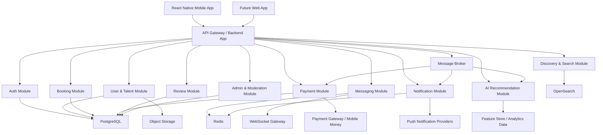
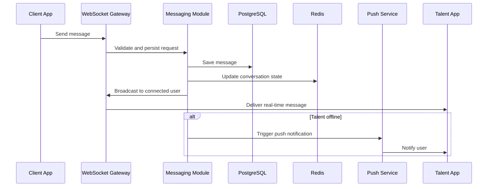
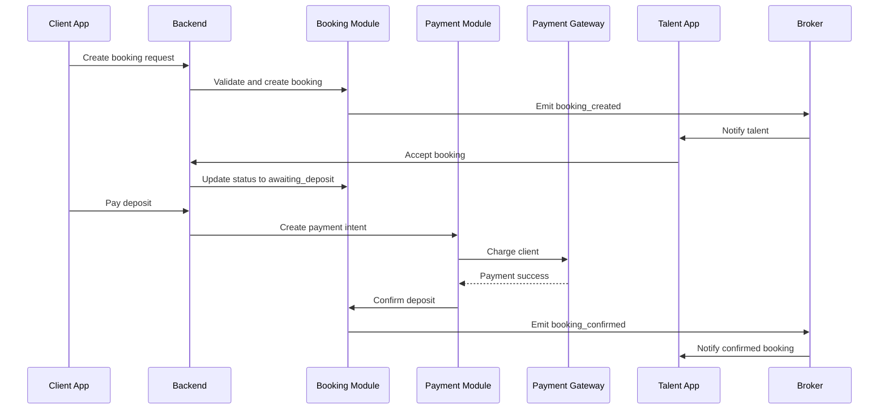

# Musician's Arena System Architecture

## 1. Architecture Approach

Recommended launch architecture: modular monolith with service boundaries.

Why:
- Faster to build than microservices
- Lower operational complexity
- Easier to test booking and payment workflows
- Still allows future extraction of high-scale modules

When the platform grows, extract:
- Messaging
- Search
- Notifications
- AI recommendations
- Payments orchestration

## 2. High-Level Architecture

## 3. Client Applications

### Mobile App
- React Native with TypeScript
- Shared design system
- TanStack Query for server data
- Zustand or Redux Toolkit for client state
- WebSocket client for chat and live booking updates

### Future Web App
- Next.js or React web app
- Reuse the same backend APIs and business rules

## 4. Backend Modules

### API Gateway / Main Backend
Responsibilities:
- Route requests
- Authenticate users
- Enforce authorization
- Aggregate module responses
- Expose REST and WebSocket endpoints

Recommended framework:
- Django with Django REST Framework and Django Channels

Recommended project structure:
- Django apps for `auth`, `profiles`, `bookings`, `payments`, `messaging`, `notifications`, `reviews`, and `admin_ops`
- DRF for REST APIs consumed by React Native and the future web app
- Channels for WebSocket connections
- Celery workers for asynchronous processing

### Auth Module
Responsibilities:
- Registration
- Login
- OTP verification
- Session management
- Access token and refresh token issuance

### User and Talent Module
Responsibilities:
- User profiles
- Talent portfolios
- Verification state
- Availability schedules
- Pricing bands

### Discovery and Search Module
Responsibilities:
- Search indexing
- Filtering
- Ranking
- Featured listings
- Recommended talent retrieval

### Booking Module
Responsibilities:
- Booking request creation
- Counteroffers
- Status transitions
- Availability locking
- Event reminders
- Completion and dispute state

### Messaging Module
Responsibilities:
- Conversation creation
- Message delivery
- Read receipts
- Presence and online state

### Payment Module
Responsibilities:
- Deposit collection
- Balance collection
- Escrow holding rules
- Commission deduction
- Payout creation
- Refund handling

### Review Module
Responsibilities:
- Ratings
- Reviews
- Moderation checks
- Reliability score aggregation

### Notification Module
Responsibilities:
- Push notifications
- In-app notifications
- Templates
- Retry and delivery tracking

### Admin and Moderation Module
Responsibilities:
- User verification
- Fraud review
- Content takedown
- Dispute management
- Operational dashboards

### AI Recommendation Module
Responsibilities:
- Match scoring
- Talent recommendation
- Natural language search interpretation
- Pricing suggestions
- Abuse anomaly detection

## 5. Data and Infrastructure Components

### PostgreSQL
Use for:
- Users
- Profiles
- Bookings
- Transactions
- Reviews
- Payouts
- Disputes

Why:
- Strong transactional consistency
- Great for booking, payment, and relational data

### Redis
Use for:
- Session cache
- Rate limiting
- Presence state
- Hot search cache
- Chat delivery support
- Celery broker and result backend support where appropriate

### OpenSearch
Use for:
- Full-text search
- Filtered talent discovery
- Relevance ranking
- Availability-aware results

### Object Storage
Use for:
- Profile pictures
- Performance videos
- Audio samples
- Documents

### Message Broker
Use for:
- Booking-created events
- Payment-confirmed events
- Reminder scheduling
- Notification fanout
- Analytics pipelines

Recommended options:
- RabbitMQ at MVP
- Kafka at high scale

### Celery Workers
Use for:
- Push notification delivery
- SMS or OTP dispatch
- Reminder scheduling
- Search index updates
- Payment reconciliation
- Payout processing

## 6. Realtime Messaging Architecture

## 7. Booking and Payment Architecture

## 8. Scalability Strategy

### Phase 1: MVP
- Single codebase with strong module boundaries
- PostgreSQL primary database
- Redis cache
- Basic worker queue
- Single search index

### Phase 2: Growth
- Read replicas for PostgreSQL
- CDN for media
- Dedicated notification workers
- Dedicated WebSocket nodes
- Separate search service

### Phase 3: Large Scale
- Extract messaging into its own service
- Extract search and recommendation services
- Introduce event streaming analytics
- Partition very large tables
- Use region-aware delivery where needed

## 9. Security Architecture

- JWT access tokens and refresh tokens
- OTP verification for phone-based onboarding
- Role-based access control
- Web application firewall and API rate limits
- Encryption in transit with TLS
- Encryption at rest for sensitive data
- Signed URLs for private media access
- Audit logs for booking, payout, and moderation actions

## 10. Observability

Use:
- Sentry for error tracking
- Prometheus for metrics
- Grafana for dashboards
- Centralized logs
- Alerting on payment failures, notification failures, and queue backlogs

Key alerts:
- High booking failure rate
- Payment timeout spikes
- Push delivery failure surge
- WebSocket disconnect anomalies
- Search latency degradation

## 11. Recommended Deployment Model

### Early Stage
- Containerized deployment
- Managed PostgreSQL
- Managed Redis
- Managed object storage
- One Django app cluster
- One Channels or ASGI cluster for realtime workloads
- One Celery worker cluster

### Mature Stage
- Kubernetes
- Dedicated autoscaling for API, workers, chat gateway, and indexing pipelines
- Blue/green or canary deployments
